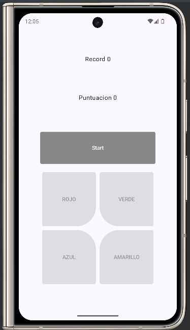
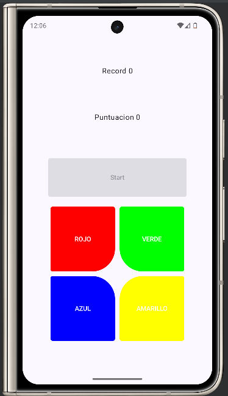

# Descripción del Proyecto

Este es mi proyecto de Simón Dice desarrollado en Kotlin utilizando Jetpack Compose. La aplicación implementa la arquitectura MVVM, corutinas y el patrón Observer para crear una experiencia interactiva, modular y mantenible.

El objetivo del juego es repetir la secuencia generada por la aplicación presionando los botones de colores en el orden correcto. Si fallas, ¡puedes intentarlo de nuevo! Aunque por el momento esta incompleto y solo se puede jugar la primera ronda, se podría decir que es un juego de adivinar el boton por ahora.

##

## Características Técnicas
### 1. Arquitectura MVVM

La arquitectura está claramente dividida en las siguientes capas:

**Modelo (ViewModel)**

La lógica del juego se gestiona en la clase ModelView:
```kotlin
class ModelView : ViewModel() {
    val estadoLiveData: MutableLiveData<Estados?> = MutableLiveData(Estados.INICIO)

    fun crearRandom() {
        estadoLiveData.value = Estados.GENERANDO
        _numbers.value = (1..4).random()
        actualizarNumero(_numbers.value)
    }

    fun compararNumero(numero: Int): Boolean {
        if (numero == Datos.numero) {
            increaseScore()
            estadoLiveData.value = Estados.INICIO
            return true
        } else {
            estadoLiveData.value = Estados.ADIVINANDO
            return false
        }
    }
}

```

Esta clase:

- Genera secuencias aleatorias (crearRandom).
- Actualiza y compara las entradas del usuario (compararNumero).
- Usa LiveData para notificar cambios de estado a la UI.

**Vista**


La interfaz se define con Jetpack Compose en funciones como `IU`:
```kotlin
@Composable
fun IU(model: ModelView) {
    val context = LocalContext.current
    var puntuacion by remember { mutableIntStateOf(model.getScore()) }

    Column(modifier = Modifier.align(Alignment.Center)) {
        Text("Puntuación $puntuacion", textAlign = TextAlign.Center)
        Boton_start(model = model, color = Colores.START, context = context)
        Row {
            Boton(model = model, color = Colores.ROJO, context = context)
            Boton(model = model, color = Colores.VERDE, context = context)
        }
        Row {
            Boton(model = model, color = Colores.AZUL, context = context)
            Boton(model = model, color = Colores.AMARILLO, context = context)
        }
    }
}

```

Cada elemento de la UI (botones y textos) está vinculado al estado gestionado en el ViewModel.

##

### 2. Patrón Observer
La aplicación utiliza `LiveData` para observar y reaccionar a cambios de estado:
```kotlin
model.estadoLiveData.observe(LocalLifecycleOwner.current) {
    _activo = model.estadoLiveData.value!!.boton_activo
}
```
Esto asegura que los botones y otras partes de la UI cambien dinámicamente según el flujo del juego.

##

### 3. Uso de Corutinas
Se utilizan corutinas tanto en **ViewModel** como en **Jetpack Compose**:

**En ViewModel**

Las corutinas gestionan tareas asincrónicas como transiciones de estado:
```kotlin
fun estadosAuxiliares() {
    viewModelScope.launch {
        delay(1500)
        Log.d("estadosAuxiliares", "Cambio de estado auxiliar")
    }
}
```

**En Jetpack Compose**

El botón de inicio utiliza `LaunchedEffect` para animarse mientras está activo:
```kotlin
LaunchedEffect(_activo) {
    while (_activo) {
        _color = color.color_suave
        delay(500)
        _color = color.colorname
        delay(100)
    }
}
```

##

### 4. Dificultad y Complejidad
La aplicación implementa características avanzadas:

- Estados dinámicos usando enums para manejar el flujo del juego.
```kotlin
enum class Estados(val start_activo: Boolean, val boton_activo: Boolean) {
    INICIO(start_activo = true, boton_activo = false),
    GENERANDO(start_activo = false, boton_activo = false),
    ADIVINANDO(start_activo = false, boton_activo = true),
}
```
- Componentes de botones reutilizables que manejan lógica y diseño:
kotlin
```kotlin
@Composable
fun Boton(model: ModelView, color: Colores, context: Context) {
    TextButton(
        enabled = _activo,
        onClick = { if (model.compararNumero(color.color)) { /* Gana */ } },
        colors = ButtonDefaults.buttonColors(color.colorname)
    ) {
        Text("$color")
    }
}

```

##

## Documentación del Código
El código está completamente documentado para facilitar la comprensión:

Ejemplo de comentario en `Boton_start`:
```kotlin
/**
 * Función composable que define el botón de inicio con color y comportamiento específicos.
 *
 * @param model La instancia de ViewModel que gestiona el estado y la lógica de la aplicación.
 * @param color Las propiedades de color para el botón.
 * @param context El contexto en el que se usa el botón.
 */
@Composable
fun Boton_start(model: ModelView, color: Colores, context: Context) {
```

## Imagenes


